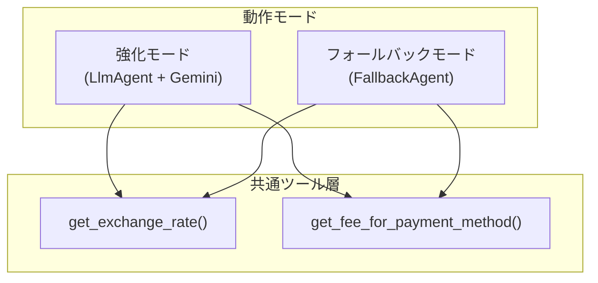
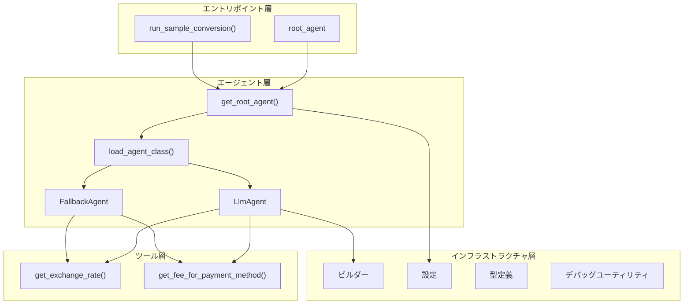
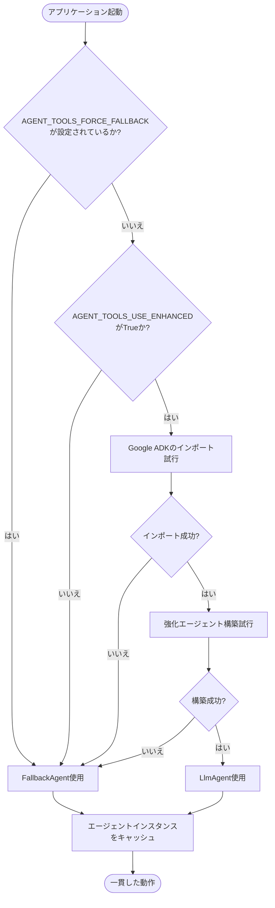
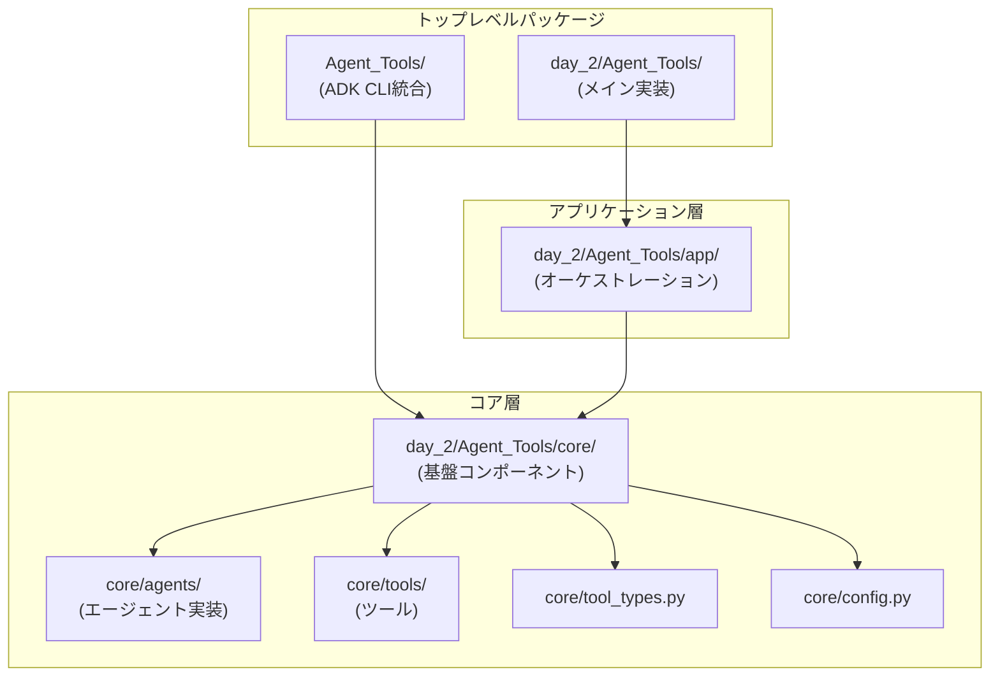
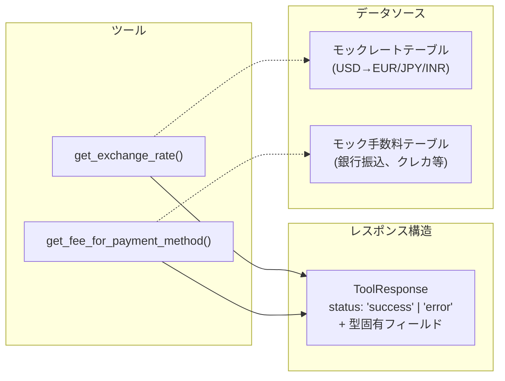

# 概要

## 関連ソースファイル

## 目的と範囲

このドキュメントは、5日間AIエージェント集中コースのコードベースの概要を提供します。これは、強化モード(Google ADKベース)とフォールバックモード(スタンドアロン)の両方をサポートするデュアルパスアーキテクチャで設計された通貨変換エージェントシステムです。このシステムは、外部依存関係が利用できない場合に適切にデグレードするAIエージェントを構築するための本番環境対応のパターンを示しています。

特定のサブシステムに関する詳細情報については:

- アーキテクチャパターンとコンポーネント層: アーキテクチャ概要を参照
- コア用語と設計パターン: 主要概念を参照
- エージェント実装の詳細: エージェントシステムを参照
- ツールインターフェース仕様: ツールシステムを参照
- 開発セットアップと使用方法: 開発とデプロイメントを参照

## システムの目的

このコードベースは、以下の機能を持つ通貨変換アシスタントを実装しています:

- 通貨ペア間の為替レートの取得
- 異なる支払い方法のトランザクション手数料の計算
- 手数料控除を含むエンドツーエンドの通貨変換計算の実行
- 変換ステップの詳細な内訳の提供

システムは2つのモードで動作するように構造化されています:

| モード | 実装 | 依存関係 | ユースケース |
|--------|------|----------|--------------|
| 強化モード | Google ADKのLlmAgentとGeminiモデル | google-adkパッケージが必要 | LLMによるツールオーケストレーションを使用した本番デプロイメント |
| フォールバックモード | FallbackAgentスタンドアロン実装 | 外部AI依存関係なし | 開発、テスト、CI環境、または依存関係フリーのデプロイメント |

両方のモードは同一のインターフェースを公開し、同じ通貨変換ツールを利用することで、動作モードに関係なく一貫した動作を保証します。



## コアコンポーネント

システムは4つの主要層で構成されています:



コンポーネント概要:

| 層 | コンポーネント | 責任 |
|----|--------------|------|
| エントリポイント | root_agent, run_sample_conversion() | CLI/ノートブック使用のための事前設定済みエージェントインスタンスの公開 |
| エージェント層 | get_root_agent(), load_agent_class(), LlmAgent, FallbackAgent | エージェントの選択、インスタンス化、ライフサイクル管理 |
| ツール層 | get_exchange_rate(), get_fee_for_payment_method() | 通貨変換と手数料検索機能の提供 |
| インフラストラクチャ | ビルダー、設定、型定義、デバッグユーティリティ | エージェント構築、ランタイム設定、診断のサポート |

## エージェント選択メカニズム

システムは、複数段階の決定プロセスを使用して、強化エージェントとフォールバックエージェントを動的に選択します:



決定はモジュールインポート時に一度だけ行われ、アプリケーションのライフサイクル全体でキャッシュされます。これにより、実行全体で一貫したエージェント動作が保証されます。

## エントリポイント

システムは2つの主要なエントリポイントを提供します:

### 1. Google ADK CLIエントリポイント
場所: `Agent_Tools/agent.py`

```python
# 簡略化された構造
root_agent = build_enhanced_currency_agent()  # または例外発生時にフォールバック
```

このモジュールは、Google ADKコマンドラインインターフェースのエントリポイントとして機能する`root_agent`インスタンスを公開します。`build_enhanced_currency_agent()`を使用して強化エージェントの構築を試み、構築に失敗した場合は`FallbackAgent`にフォールバックします。

### 2. アプリケーションエントリポイント
場所: `day_2/Agent_Tools/__init__.py`および`day_2/Agent_Tools/app/agent.py`

```python
# エクスポートされるシンボル
root_agent = get_root_agent()
run_sample_conversion(query: str) -> None
```

アプリケーションエントリポイントは以下を提供します:

- `root_agent`: 環境設定に基づいて選択された事前設定済みエージェントインスタンス
- `run_sample_conversion()`: 変換クエリを実行し、デバッグ出力を表示する手動テスト用ヘルパー関数

## モジュール構成

コードベースは階層化されたパッケージ構造に従います:



パッケージの責任:

| パッケージパス | 目的 | 主要エクスポート |
|--------------|------|----------------|
| Agent_Tools/ | Google ADK CLI統合 | root_agent |
| day_2/Agent_Tools/ | メイン実装パッケージ | root_agent, run_sample_conversion |
| day_2/Agent_Tools/app/ | アプリケーションオーケストレーション層 | get_root_agent(), エージェントライフサイクル管理 |
| day_2/Agent_Tools/core/ | コア構成要素 | すべてのエージェント、ツール、型、設定 |
| day_2/Agent_Tools/core/agents/ | エージェント実装 | FallbackAgent |
| day_2/Agent_Tools/core/tools/ | 通貨変換ツール | get_exchange_rate(), get_fee_for_payment_method() |

coreパッケージは基盤として機能し、独立してインポート可能な再利用可能なコンポーネントを提供します。appレイヤーはこれらのコンポーネントをオーケストレートしてエージェントのライフサイクルを管理し、トップレベルパッケージは簡略化されたエントリポイントを提供します。

## ツールシステム

両方のエージェント実装は、標準化されたレスポンスタイプを持つ共通のツールセットを利用します:



ツール仕様:

| ツール関数 | パラメータ | 戻り値 | データソース |
|----------|----------|--------|------------|
| get_exchange_rate() | base_currency: str<br/>target_currency: str | レートまたはエラーを含むToolResponse | モックレートテーブル(USD→EUR/JPY/INR) |
| get_fee_for_payment_method() | payment_method: str | fee_percentageまたはエラーを含むToolResponse | モック手数料テーブル(銀行振込、クレジットカード等) |

すべてのツールは、必須の`status`フィールド("success"または"error")を持つ構造化された`ToolResponse`オブジェクトを返し、両方のエージェント実装で一貫したエラー処理を保証します。

## 実行パターン

システムは、エージェントタイプに応じて2つの実行パターンをサポートします:

### 強化エージェント実行
強化エージェントは、Geminiモデルを使用して自然言語クエリを解釈し、呼び出すツールを決定し、変換ワークフローをオーケストレートします。

### フォールバックエージェント実行
フォールバックエージェントは、直接的なツール呼び出し、または構造化されたキーワード引数を使用した複数ステップのワークフローのオーケストレーションにより、決定論的な実行を提供します。

## 設定システム

ランタイム動作は、環境変数と設定定数を通じて制御されます:

| 設定 | 場所 | 目的 | デフォルト |
|------|------|------|-----------|
| AGENT_TOOLS_USE_ENHANCED | core/config.py | 強化エージェントの有効化/無効化 | True |
| AGENT_TOOLS_FORCE_FALLBACK | core/config.py | ADKの可用性に関係なくフォールバックモードを強制 | False |
| AGENT_TOOLS_MODEL_NAME | core/config.py | コード実行用のGeminiモデル名 | gemini-1.5-flash |
| CODE_EXEC_MODEL | core/config.py | モデル設定定数 | 環境変数またはデフォルトから |
| retry_config | core/config.py | HTTPリトライ設定 | types.HttpRetryOptions |

これらの設定により、オペレーターはコード変更なしでエージェントの選択、モデルの選択、リトライ動作を制御できます。

## まとめ

5日間AIエージェント集中コースのコードベースは、適切なデグレードを備えたAIエージェントシステムを構築するための本番環境対応パターンを示しています。主要なアーキテクチャ原則は以下の通りです:

- **インターフェースの一貫性**: 強化エージェントとフォールバックエージェントの両方が`BaseAgent`プロトコルを実装し、同じ`.tools`属性を公開
- **フェイルセーフ設計**: システムは外部AI依存関係なしで完全な機能を維持しながら動作可能
- **型安全性**: `ToolResponse`型による強力な型付けにより、静的解析が可能になりランタイムエラーを防止
- **関心の分離**: エントリポイント、エージェントロジック、ツール、インフラストラクチャ間の明確な階層化
- **ランタイム設定可能性**: 環境変数がエージェントの選択とモデル設定を制御

このアーキテクチャは、開発環境から本番システム、ローカルテストからCI/CDパイプライン、依存関係に制約のある環境から完全機能のAI駆動デプロイメントまで、多様なデプロイメントシナリオをサポートします。
