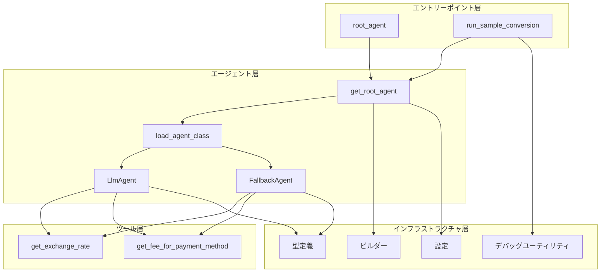
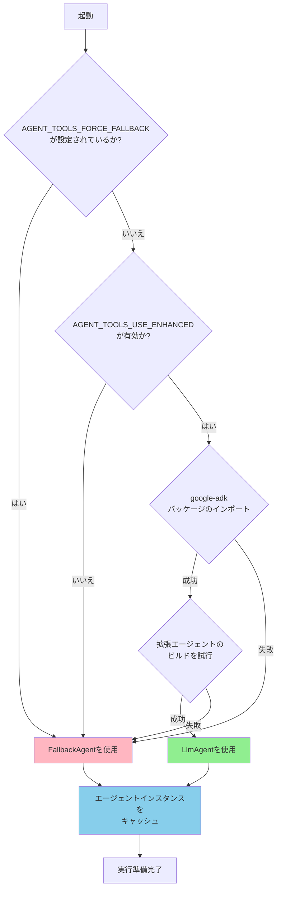
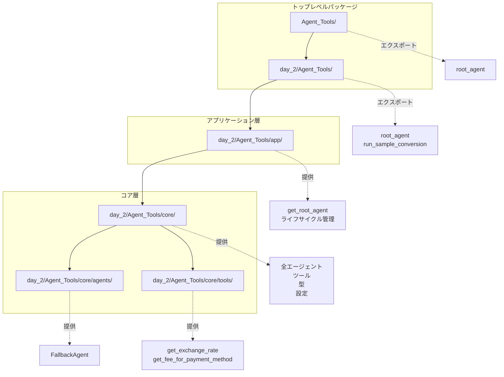
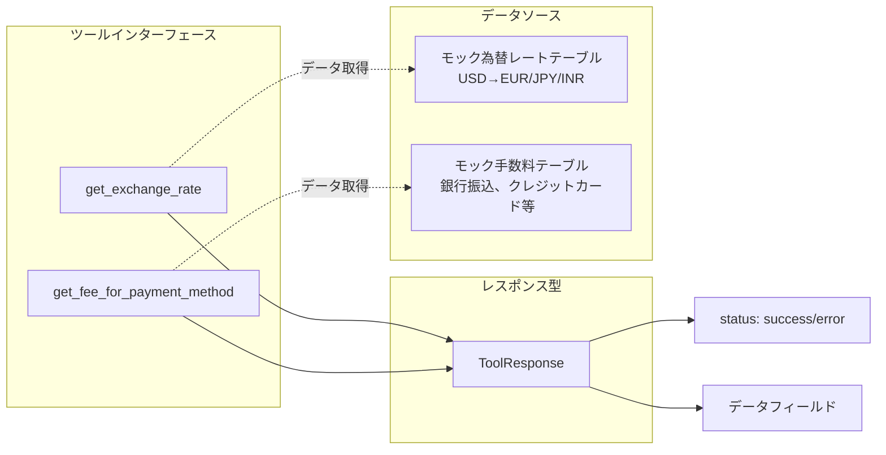
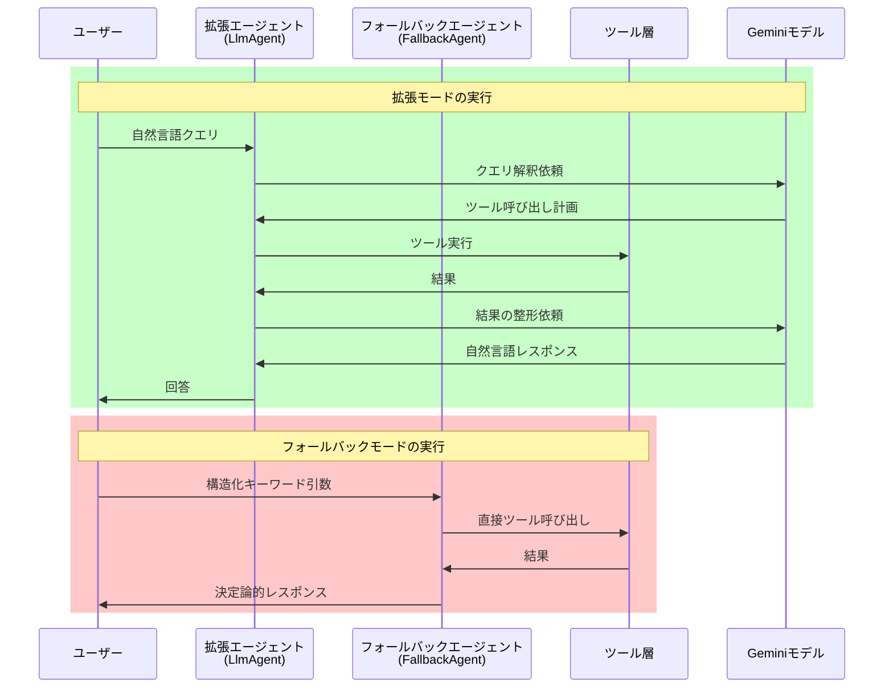
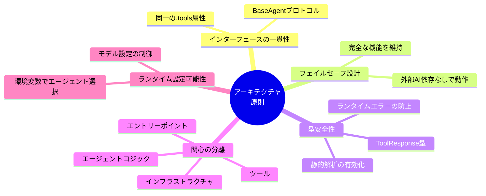

# 概要

## 関連するソースファイル

## 目的とスコープ

このドキュメントは、5-Day AI Agents Intensiveコードベースの概要を提供します。これは、拡張モード（Google ADKベース）とフォールバックモード（スタンドアロン）の両方をサポートするデュアルパスアーキテクチャで設計された通貨換算エージェントシステムです。このシステムは、外部依存関係が利用できない場合でも適切に機能を縮退させる、本番環境対応のAIエージェント構築パターンを実証しています。

特定のサブシステムの詳細情報については以下を参照してください：

- アーキテクチャパターンとコンポーネントレイヤー：Architecture Overviewを参照
- 中心的な用語と設計パターン：Key Conceptsを参照
- エージェント実装の詳細：Agent Systemを参照
- ツールインターフェース仕様：Tool Systemを参照
- 開発セットアップと使用方法：Development and Deploymentを参照

## システムの目的

このコードベースは、以下の機能を持つ通貨換算アシスタントを実装しています：

- 通貨ペア間の為替レートの取得
- 異なる支払い方法に対する取引手数料の計算
- 手数料控除を含むエンドツーエンドの通貨換算計算
- 換算ステップの詳細な内訳の提供

システムは2つのモードで動作するように構造化されています：

| モード | 実装 | 依存関係 | ユースケース |
|--------|------|----------|--------------|
| 拡張モード | Google ADKのLlmAgentとGeminiモデル | google-adkパッケージが必要 | LLM駆動のツールオーケストレーションを使用する本番デプロイ |
| フォールバックモード | FallbackAgentスタンドアロン実装 | 外部AI依存関係なし | 開発、テスト、CI環境、または依存関係フリーのデプロイ |

両方のモードは同一のインターフェースを公開し、同じ通貨換算ツールを利用するため、動作モードに関係なく一貫した動作が保証されます。

**出典:** 
- `Agent_Tools/agent.py` (1-38行)
- `day_2/Agent_Tools/app/agent.py` (1-120行)
- `day_2/Agent_Tools/README.md` (1-130行)

---

## コアコンポーネント

システムは4つの主要レイヤーで構成されています：



### コンポーネント概要

| レイヤー | コンポーネント | 責務 |
|----------|---------------|------|
| エントリーポイント | root_agent, run_sample_conversion() | CLI/ノートブック使用のための事前設定済みエージェントインスタンスを公開 |
| エージェント層 | get_root_agent(), load_agent_class(), LlmAgent, FallbackAgent | エージェントの選択、インスタンス化、ライフサイクル管理 |
| ツール層 | get_exchange_rate(), get_fee_for_payment_method() | 通貨換算と手数料照会機能を提供 |
| インフラストラクチャ | ビルダー、設定、型定義、デバッグユーティリティ | エージェント構築、ランタイム設定、診断をサポート |

**出典:** 
- `Agent_Tools/agent.py` (1-38行)
- `day_2/Agent_Tools/core/__init__.py` (1-37行)
- `day_2/Agent_Tools/app/agent.py` (67-94行)

---

## エージェント選択メカニズム

システムは、多段階の決定プロセスを使用して、拡張エージェントとフォールバックエージェントを動的に選択します：



決定はモジュールのインポート時に一度だけ行われ、アプリケーションのライフサイクル全体でキャッシュされます。これにより、実行全体を通じて一貫したエージェントの動作が保証されます。

**出典:** 
- `day_2/Agent_Tools/app/agent.py` (67-87行)
- `day_2/Agent_Tools/core/compat.py`
- `Agent_Tools/agent.py` (18-35行)

---

## エントリーポイント

システムは2つの主要なエントリーポイントを提供します：

### 1. Google ADK CLIエントリーポイント

**場所:** `Agent_Tools/agent.py` (1-38行)

```python
# 簡略化された構造
root_agent = build_enhanced_currency_agent()  # または例外発生時にフォールバック
```

このモジュールは、Google ADKコマンドラインインターフェースのエントリーポイントとして機能する`root_agent`インスタンスを公開します。`build_enhanced_currency_agent()`を使用して拡張エージェントの構築を試み、構築に失敗した場合は`FallbackAgent`にフォールバックします。

### 2. アプリケーションエントリーポイント

**場所:** 
- `day_2/Agent_Tools/__init__.py` (1-3行)
- `day_2/Agent_Tools/app/agent.py` (67-120行)

```python
# エクスポートされるシンボル
root_agent = get_root_agent()
run_sample_conversion(query: str) -> None
```

アプリケーションエントリーポイントは以下を提供します：

- **root_agent**: 環境設定に基づいて選択された事前設定済みエージェントインスタンス
- **run_sample_conversion()**: 換算クエリを実行してデバッグ出力を表示する手動テスト用のヘルパー関数

**出典:** 
- `Agent_Tools/agent.py` (1-38行)
- `day_2/Agent_Tools/__init__.py` (1-3行)
- `day_2/Agent_Tools/app/agent.py` (67-120行)

---

## モジュール構成

コードベースは階層化されたパッケージ構造に従っています：



### パッケージの責務

| パッケージパス | 目的 | 主要なエクスポート |
|----------------|------|-------------------|
| `Agent_Tools/` | Google ADK CLI統合 | root_agent |
| `day_2/Agent_Tools/` | メイン実装パッケージ | root_agent, run_sample_conversion |
| `day_2/Agent_Tools/app/` | アプリケーションオーケストレーション層 | get_root_agent(), エージェントライフサイクル管理 |
| `day_2/Agent_Tools/core/` | コアビルディングブロック | 全エージェント、ツール、型、設定 |
| `day_2/Agent_Tools/core/agents/` | エージェント実装 | FallbackAgent |
| `day_2/Agent_Tools/core/tools/` | 通貨換算ツール | get_exchange_rate(), get_fee_for_payment_method() |

`core`パッケージは基盤として機能し、独立してインポートできる再利用可能なコンポーネントを提供します。`app`層はこれらのコンポーネントをオーケストレーションし、エージェントのライフサイクルを管理します。一方、トップレベルのパッケージは簡略化されたエントリーポイントを提供します。

**出典:** 
- `day_2/Agent_Tools/README.md` (15-39行)
- `day_2/Agent_Tools/core/__init__.py` (1-37行)

---

## ツールシステム

両方のエージェント実装は、標準化されたレスポンスタイプを持つ共通のツールセットを利用します：



### ツール仕様

| ツール関数 | パラメータ | 戻り値 | データソース |
|-----------|-----------|--------|--------------|
| get_exchange_rate() | base_currency: str<br>target_currency: str | レートまたはエラーを含むToolResponse | モックレートテーブル（USD→EUR/JPY/INR） |
| get_fee_for_payment_method() | payment_method: str | fee_percentageまたはエラーを含むToolResponse | モック手数料テーブル（銀行振込、クレジットカード等） |

すべてのツールは、必須の`status`フィールド（"success"または"error"）を持つ構造化された`ToolResponse`オブジェクトを返し、両方のエージェント実装で一貫したエラーハンドリングを保証します。

**出典:** 
- `day_2/Agent_Tools/core/tool_types.py`
- `day_2/Agent_Tools/core/tools/rate.py`
- `day_2/Agent_Tools/core/tools/payment.py`
- `day_2/Agent_Tools/README.md` (73-90行)

---

## 実行パターン

システムは、エージェントタイプに応じて2つの実行パターンをサポートします：



### 拡張エージェントの実行

拡張エージェントは、Geminiモデルを使用して自然言語クエリを解釈し、どのツールを呼び出すかを決定し、換算ワークフローをオーケストレーションします。

### フォールバックエージェントの実行

フォールバックエージェントは、構造化されたキーワード引数を使用して、直接的なツール呼び出しまたはオーケストレーションされた複数ステップのワークフローを通じて、決定論的な実行を提供します。

**出典:** 
- `day_2/Agent_Tools/app/agent.py` (97-113行)
- `day_2/Agent_Tools/core/agents/fallback.py`
- `day_2/Agent_Tools/README.md` (93-119行)

---

## 設定システム

ランタイム動作は、環境変数と設定定数によって制御されます：

| 設定 | 場所 | 目的 | デフォルト値 |
|------|------|------|--------------|
| AGENT_TOOLS_USE_ENHANCED | core/config.py | 拡張エージェントの有効/無効化 | True |
| AGENT_TOOLS_FORCE_FALLBACK | core/config.py | ADKの可用性に関係なくフォールバックモードを強制 | False |
| AGENT_TOOLS_MODEL_NAME | core/config.py | コード実行用のGeminiモデル名 | gemini-1.5-flash |
| CODE_EXEC_MODEL | core/config.py | モデル設定定数 | 環境変数またはデフォルト値から |
| retry_config | core/config.py | HTTPリトライ設定 | types.HttpRetryOptions |

これらの設定により、オペレーターはコード変更なしで、エージェント選択、モデル選択、リトライ動作を制御できます。

**出典:** 
- `day_2/Agent_Tools/core/config.py`
- `day_2/Agent_Tools/README.md` (119行)

---

## まとめ

5-Day AI Agents Intensiveコードベースは、適切な機能縮退を備えたAIエージェントシステムを構築するための本番環境対応パターンを実証しています。主要なアーキテクチャ原則は以下の通りです：



### 主要な設計原則

1. **インターフェースの一貫性**: 拡張エージェントとフォールバックエージェントの両方が`BaseAgent`プロトコルを実装し、同じ`.tools`属性を公開
2. **フェイルセーフ設計**: システムは外部AI依存関係なしで完全な機能を維持しながら動作可能
3. **型安全性**: `ToolResponse`型による強力な型付けにより、静的解析が可能になりランタイムエラーを防止
4. **関心の分離**: エントリーポイント、エージェントロジック、ツール、インフラストラクチャ間の明確な階層化
5. **ランタイム設定可能性**: 環境変数がエージェント選択とモデル設定を制御

このアーキテクチャは、以下のような多様なデプロイシナリオをサポートします：

- 開発環境から本番システムまで
- ローカルテストからCI/CDパイプラインまで
- 依存関係制約のある環境から、完全機能のAI駆動デプロイまで

**出典:** 
- `day_2/Agent_Tools/README.md` (123-129行)
- `Agent_Tools/agent.py` (1-38行)
- `day_2/Agent_Tools/core/__init__.py` (1-37行)
